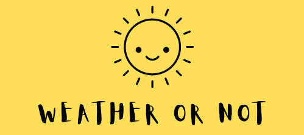

    

# Weather Or Not

 ### Reading temperatures from traditional weather sources is often mundane and tedious. Instead, why not read a quick funny note about the current weather to brighten up your potentially cloudy day?  
   
  
This project was done at HackHarvard 2022.

You can find more about this project at Devpost: https://devpost.com/software/weather-or-not-w29v4e

Demo: https://dapper-brioche-69e4d3.netlify.app/

Contributors:

* Yuhong Zhao: [GitHub](https://github.com/yuhongz12) [LinkedIn](https://www.linkedin.com/in/yuhong-zhao-ab0a141b2/)
* Maminiaina Ravaloarison : [GitHub](https://github.com/Mami-Em) [LinkedIn](https://www.linkedin.com/in/maminiaina-ravaloarison-ab1893245/)
* Sandy Zheng: [GitHub](https://github.com/sandyzng104) [LinkedIn](https://www.linkedin.com/in/sandyzheng/)

--- 

## Inspiration
The monotony of searching up the weather does not generate the excitement necessary to encourage users to check it every day. The importance of frequently checking it cannot be understated in preventing any unpleasant surprises. We hoped to come up with a way that would make people, specifically the younger generation, look forward to looking up the weather often.

## What it does
It replaces the typical temperature readings with either slang or pretentious jargon. This allows users to not only get a laugh out at least once a day, but also are able to quickly understand what possibilities the weather could allow them to do in a silly manner.

## How we built it
We used ReactJS for the front-end application and handle client-side logic. We also embedded Bootstrap for the basic style of the elements as well as some customized CSS. For the backend, we used Flask, a Python web Framework to query the API and output the data to React in JSON format.

## Challenges we ran into
Working with React and API, one of the most common challenges we ran into was our HTTP request being blocked by CORS policy and our React render elements being blocked by Adblocker. There was a couple of ways to solve this challenge, which was to use a proxy server. Another issue we ran into was we hit our limit for the API, and therefore the API wouldn't provide us with data anymore.

## Accomplishments that we're proud of
We are proud that we got an MVP working. Our team didn't have any formal experience with web development using React, so this was a really helpful learning experience. Despite the challenges we faced, we managed to create a working prototype.

## What we learned
We learned the basics of React and how to fetch data from API endpoints. We also learned ways to solve CORS policy problems, which we can carry with us in the future.

## What's next for Weather Or Not
We plan on creating a wider variety of slang and pretentious jargon for more specific temperature readings.
